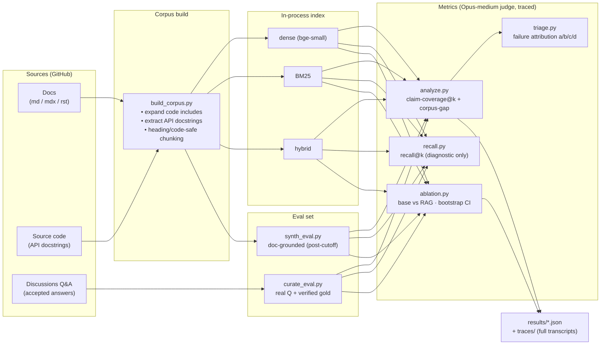
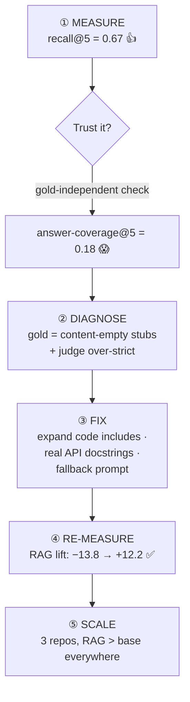
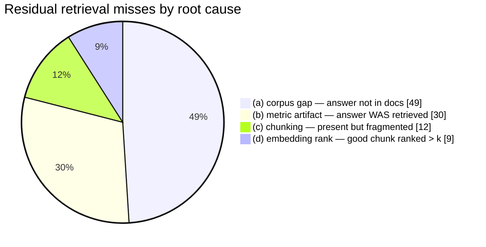

<div align="center">

# 🔎 Eval-First RAG

### Don't ask *"does RAG work?"* — **measure it, debug the measurement, then prove it.**

A documentation-QA Retrieval-Augmented Generation system rebuilt around **evaluation as the primary
artifact** — on real developer-tool docs, with a base-vs-RAG ablation, a metric-integrity
investigation, and a 3-repository scale-up.


-orange)
-lightgrey)


**📄 [`FINAL_REPORT.md`](FINAL_REPORT.md)** · 🧪 [`REPORT.md`](REPORT.md) · 🔬 [`DIAGNOSIS.md`](DIAGNOSIS.md) · 🌐 [`REPORT_MULTIREPO.md`](REPORT_MULTIREPO.md)

</div>

---

## ⭐ TL;DR

> A capable base LLM already answers a lot of developer questions. **Naive RAG can make it *worse*.**
> This project measures exactly when RAG helps, catches a 3.7× **metric illusion** that hid the
> truth, fixes the corpus, and shows the deployable RAG **beats the base model on all 3 repos** —
> with the lift tracking a metric we explicitly measure: **corpus gap**.

| Repo | Base familiarity | Corpus gap | **Fallback RAG lift vs base** | 95% CI |
|---|:---:|:---:|:---:|:---:|
| `duckdb` (moderate) | 43.5 | 0.23 | **+11.1** ✅ | [6.1, 15.9] |
| `litestar` (low) | 26.7 | 0.14 | **+14.5** ✅ | [4.1, 25.0] |
| `pydantic-ai` (post-cutoff)¹ | 24.9 | 0.05 | **+65.4** ✅ | [60.1, 70.3] |

<sub>Subject = Claude Haiku 4.5 · Judge = Claude Opus 4.8 (effort=medium) · scores 0–100 · every CI excludes 0.
¹ post-training-cutoff tool, synthetic doc-grounded eval — a knowledge-injection demo, flagged as not forum-comparable.</sub>

---

## 🧠 The thesis

Most RAG demos report a single happy number. This one treats the **evaluation** as the hard part:

```
                 ┌─────────────────────────────────────────────────────────────┐
                 │   The number you report is only as honest as how you measure │
                 └─────────────────────────────────────────────────────────────┘
```

Three findings drive everything:

1. **`recall@k` lies when gold is auto-labeled.** On the first substrate, exact `recall@5 = 0.67`
   while honest answer-coverage was **`0.18`** — the "gold" chunks were content-empty
   `<CodeExample/>` include **stubs**. We headline a **gold-independent claim-coverage** metric instead.
2. **Naive "answer-only-from-context" RAG underperformed the base model** (−13.8) until two fixes:
   a **fallback prompt** + **corpus repair** → **+12.2**.
3. **RAG wins where the base is weak *and* the docs hold the answer.** We measure **corpus gap**
   (fraction of questions the docs simply can't answer) as the covariate that explains the lift.

---

## 🏗️ Architecture



**Reused** from the original [`enterprise-copilot`](https://github.com/yx3728/enterprise-copilot)
demo: the pipeline shape (chunk → top-k → numbered context → "cite [n]" → generate) and chunking
strategies. **Replaced:** Qdrant *server* → in-process NumPy + BM25 index; OpenAI → Claude (CLI,
no API key) + local embeddings; keyword/hallucination heuristics → recall@k + claim-coverage +
LLM-judge ablation. **Dropped:** frontend / server / DB / Docker / Azure (this is a CLI eval artifact).

---

## 🔬 The eval-first loop (the core methodology)



| Stage | Before | After |
|---|---|---|
| Retrieval (honest) | claim-coverage@5 = 0.18 | **0.57** |
| RAG vs base (deployable) | −13.8 (RAG loses) | **+12.2** (RAG wins) |
| Corpus gap | unknown | measured (~0.21) |

---

## 🧭 Failure attribution — *where do retrieval misses actually come from?*

Forensic triage of every residual miss (so we fix the right thing, not reach for a reranker reflexively):



**79% (a + b) is *not* a retrieval-architecture problem.** Only ~17% is embedding/chunking-fixable.
An off-the-shelf cross-encoder reranker was tested and **hurt** (cov@5 0.57 → 0.48) — reported as a
negative result, not silently dropped.

---

## 🚀 Quickstart

> **Prereqs:** Python 3.12 · the `claude` CLI logged in (OAuth — **no API key needed**) · `gh` CLI authed.
> Generation + judging run through `claude`; embeddings are local & offline.

```bash
python -m venv .venv
.venv/bin/pip install sentence-transformers rank_bm25 scikit-learn numpy requests beautifulsoup4

# 1) pick a substrate by base-model weakness (lower = more for RAG to prove)
.venv/bin/python src/multirepo_probe.py duckdb__duckdb litestar-org__litestar

# 2) build corpus  →  curate eval set  →  metrics chain
.venv/bin/python src/build_corpus.py  duckdb__duckdb
.venv/bin/python src/curate_eval.py   duckdb__duckdb 300       # forum repos
#   (post-cutoff repo with no Q&A → synthetic: src/synth_eval.py <repo>)
.venv/bin/python src/run_metrics.py   duckdb__duckdb           # analyze + recall + ablation×2

# 3) cross-repo synthesis + provenance manifest
.venv/bin/python src/synthesize.py
```

Every judge call's **full prompt + raw response** lands in `traces/<repo>/*.jsonl`;
`results/manifest.json` maps each headline number to the file that produced it.

---

## 🗂️ Repository layout

```text
src/
  llm.py            Claude via `claude` CLI (no key) · cost/usage tracking · trace writer
  build_corpus.py   generic corpus builder  ·  corpus.py / apidocs.py  code-include expansion + API docstrings
  index.py          in-process retrieval: dense (bge-small) + BM25 + hybrid
  curate_eval.py    real Q&A → eval set with LLM-verified, content-bearing gold
  synth_eval.py     doc-grounded synthetic eval for post-cutoff repos
  analyze.py        claim-coverage@k + corpus-gap (+ optional reranker)   ← headline retrieval metric
  recall.py         recall@k (diagnostic only — can be misleading)
  ablation.py       base-vs-RAG joint judge · randomized positions · bootstrap CI · recall-conditioned
  triage.py         residual failure attribution → (a) corpus / (b) metric / (c) chunk / (d) embed
  run_metrics.py · synthesize.py · resume_ablation.py · multirepo_probe.py · ...
docs/               read-through notes, eval design, diagnosis research
results/            persisted JSON  ·  manifest.json (number → raw file)
traces/             full judge transcripts (audit trail)
FINAL_REPORT.md · REPORT.md · DIAGNOSIS.md · REPORT_MULTIREPO.md · WORKLOG.md
```

---

## 📐 Engineering decisions worth calling out

- **No API key.** Claude runs through the `claude` CLI on an OAuth account; per-call `cost_usd` and
  tokens are captured for budgeting.
- **Cheap, reproducible retrieval.** Local `bge-small` embeddings (cached) + a NumPy cosine index
  replace a Qdrant service — recall@k runs on the full set for free.
- **Judge discipline.** Judge ≠ subject (reduces self-preference); positions randomized (order bias);
  `effort=medium` (cost control at scale); verdicts cross-checked against objective signals.
- **Auditability is mandatory.** Thread-safe trace writer persists every prompt + response;
  a real **session-limit incident** (41–98% of calls silently erroring mid-run) was *caught via the
  traces*, archived, and cleanly re-run — `resume_ablation.py` re-runs only the dropped calls.
- **Content-bearing gold only.** The whole recall illusion came from empty gold; curation now
  verifies each gold chunk actually supports the answer.

---

## ⚠️ Honesty & limitations

This is a single-engineer, **single-seed, single-judge-model** study — a strong, defensible artifact,
not a peer-reviewed claim. Stated plainly in the reports:

- The familiarity × doc-richness × eval-mode axes are **entangled** — the cross-repo trend is a
  **hypothesis**, not a causal proof (3 points).
- The post-cutoff `pydantic-ai` lift (+65.4) is **synthetic-mode inflated** (doc-shaped questions ⇒
  easy retrieval); it's a knowledge-injection demonstration, not a forum-comparable number.
- Corpus-gap misses are **intrinsic** (answer absent from docs), not retriever failures.

---

## 🛣️ Project phases (the full story)

| Phase | Doc | One-liner |
|---|---|---|
| Original repo | — | Reused `enterprise-copilot`'s RAG core; replaced its keyword "eval". |
| I — Pilot | [`REPORT.md`](REPORT.md) | Substrate selection + the crown-jewel base-vs-RAG ablation. |
| II — Diagnose & fix | [`DIAGNOSIS.md`](DIAGNOSIS.md) | The recall illusion; corpus repair; −13.8 → +12.2. |
| III — Scale-up | [`REPORT_MULTIREPO.md`](REPORT_MULTIREPO.md) | 3 repos; RAG > base everywhere; lift tracks corpus-gap. |
| **Capstone** | **[`FINAL_REPORT.md`](FINAL_REPORT.md)** | **Publication-style consolidated write-up.** |

<div align="center"><sub>Built with Claude · embeddings local · ~$64 of traced LLM spend · MIT licensed</sub></div>
